I implement dreambooth https://arxiv.org/abs/2208.12242 using a plushy monkey as my subject. Text to image diffusion model fine-tuned using dreambooth technique enables generating various novel photorealistic images of the subject contextualized in different scenes.

I prepared dataset consisting of 6 images of a plushy monkey and cropped them to 512x512 resolution. This can be seen in data directory.

<table>
  <tr>
    <td>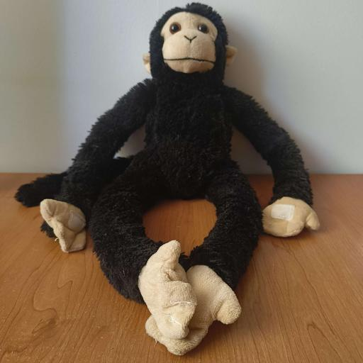</td>
    <td>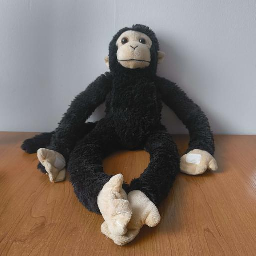</td>
    <td>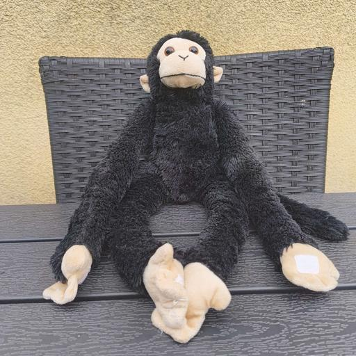</td>
  </tr>
  <tr>
    <td>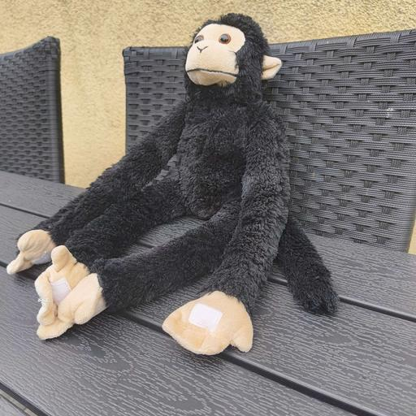</td>
    <td>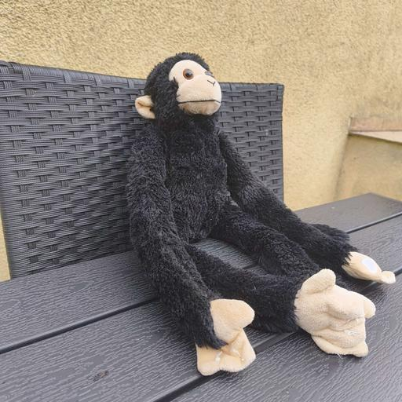</td>
    <td>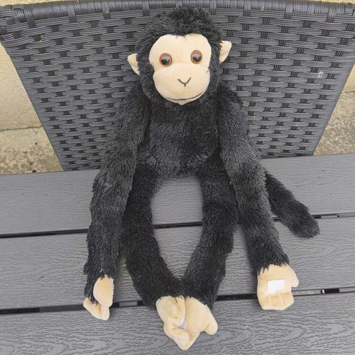</td>
  </tr>
</table>

I use train_dreambooth.py script from diffusers library: https://github.com/huggingface/diffusers/blob/main/examples/dreambooth/train_dreambooth.py

I use stable diffusion v1-5 as a base model. I fine tune CLIP-based text encoder to embedd new token "byn" which is a name of a plushy monkey I came up with. It is one token in tokenizer I use, which is desired in dreambooth.

Because of that, I was not able to train it on my laptop since my GPU has only 8 VRAM which is not enough. I used ICM's supercomputer https://kdm.icm.edu.pl.

Below, I post images which I liked the most and their corresponding prompts, these are cherry picked examples, I rejected most of the images.

### byn plushy monkey exploring a futuristic space station interior, neon lights, cyberpunk vibe

<table>
  <tr>
    <td>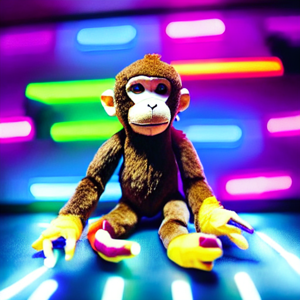</td>
  </tr>
</table>

---

### byn plushy monkey discovering a treasure at the bottom of the ocean, shafts of sunlight and shimmering seashells

<table>
  <tr>
    <td>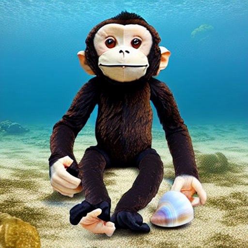</td>
  </tr>
</table>

---

### byn plushy monkey in ancient Mayan temple ruins overgrown with lush greenery, epic adventure feel

<table>
  <tr>
    <td>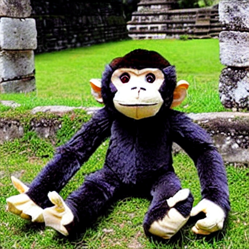</td>
    <td>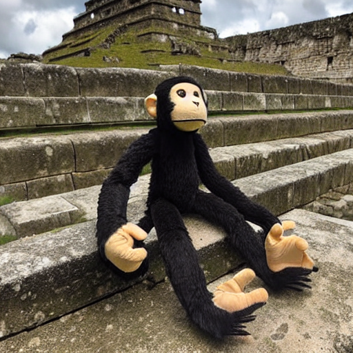</td>
    <td>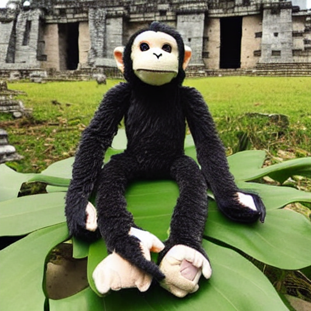</td>
  </tr>
</table>

---

### byn plushy monkey having tea in a Victorian parlor, elegant porcelain cups, warm lamplight

<table>
  <tr>
    <td>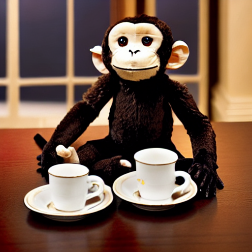</td>
  </tr>
</table>

---

### byn plushy monkey dressed as a pirate on deck, sails billowing and waves crashing, comic‑book illustration style

<table>
  <tr>
    <td>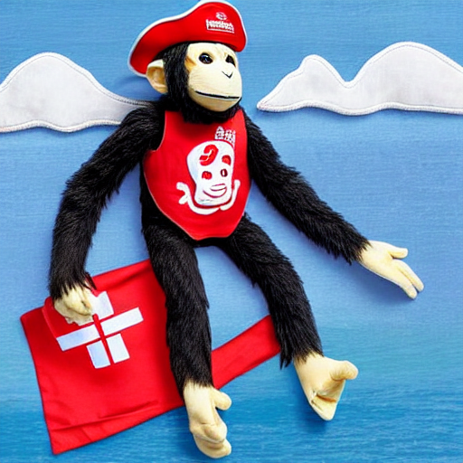</td>
  </tr>
</table>

---

### byn plushy monkey dancing at a masked ball in a Baroque ballroom, ornate decorations and crystal chandeliers

<table>
  <tr>
    <td>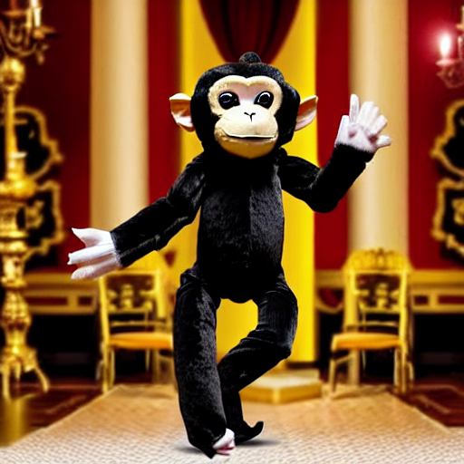</td>
    <td>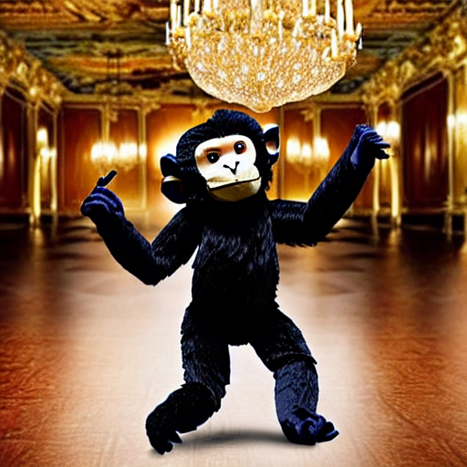</td>
  </tr>
</table>

---

### byn plushy monkey tagging graffiti on a city street at night, colorful murals and lamppost glow

<table>
  <tr>
    <td>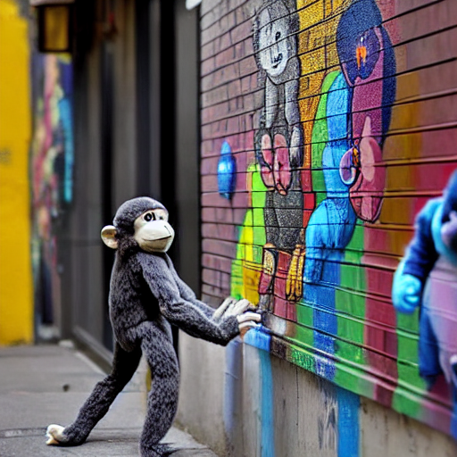</td>
  </tr>
</table>

---

### byn plushy monkey cooking in a professional restaurant kitchen, steam rising from pots, documentary‑style realism

<table>
  <tr>
    <td></td>
    <td></td>
    <td>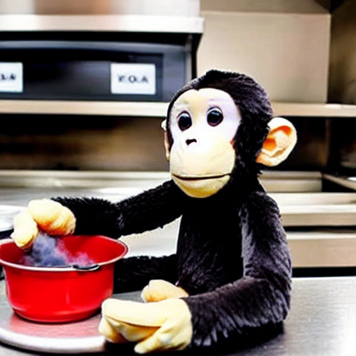</td>
  </tr>
</table>

---

### byn plushy monkey trekking across snow‑capped mountains, bright sunlight, wide‑angle landscape shot

<table>
  <tr>
    <td>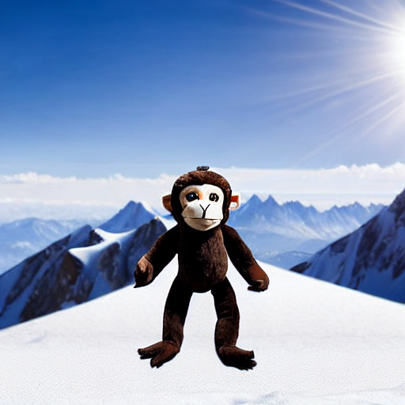</td>
    <td>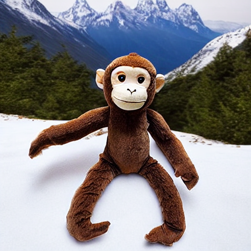</td>
    <td>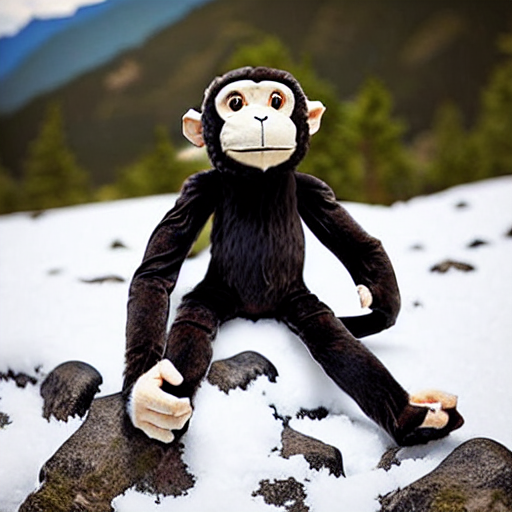</td>
  </tr>
</table>

---

### byn plushy monkey sitting on a stone pier by a misty lake at dawn, serene and peaceful mood

<table>
  <tr>
    <td></td>
    <td>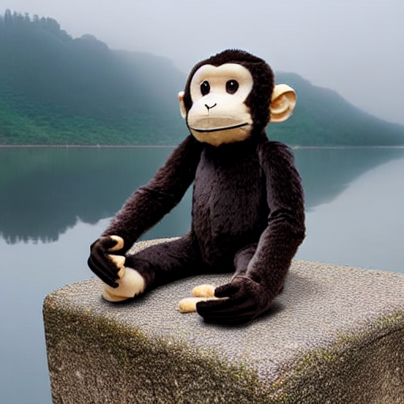</td>
  </tr>
</table>

---

### byn plushy monkey enjoying a sunset at an amusement park, carousel lights and dreamy bokeh

<table>
  <tr>
    <td>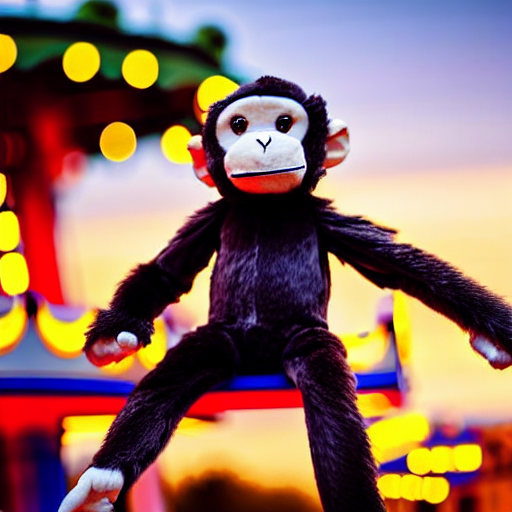</td>
    <td>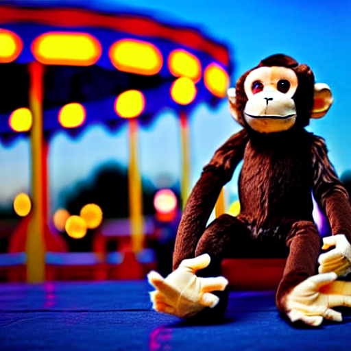</td>
    <td></td>
  </tr>
</table>

---

### byn plushy monkey as a knight on horseback at a medieval castle, epic fantasy digital art style

<table>
  <tr>
    <td>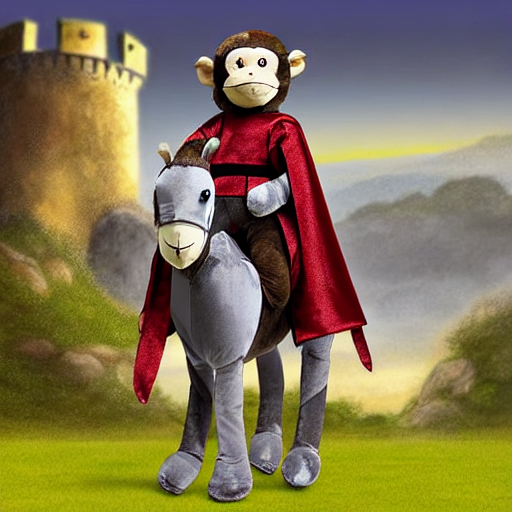</td>
    <td>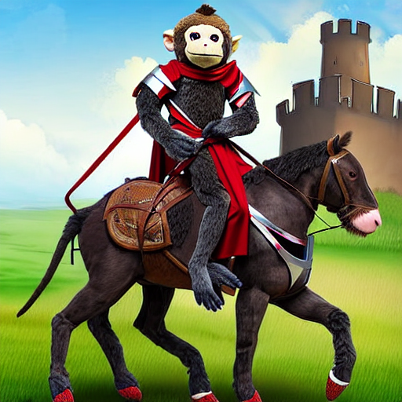</td>
  </tr>
</table>

---

### byn plushy monkey standing on a desert dune under a rising moon, dramatic shadows, minimalist composition

<table>
  <tr>
    <td>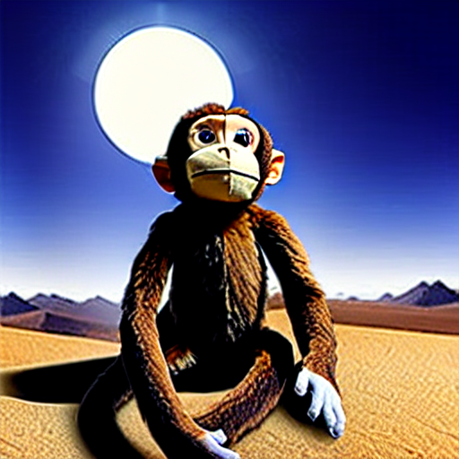</td>
  </tr>
</table>

---

### byn plushy monkey as a DJ in a techno club, pulsing lasers and dynamic crowd shot

<table>
  <tr>
    <td></td>
    <td>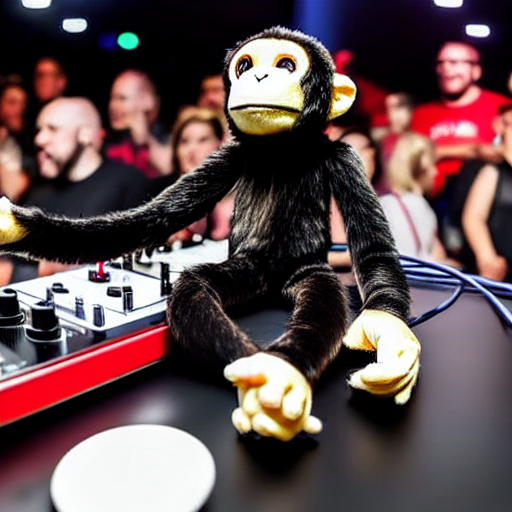</td>
    <td>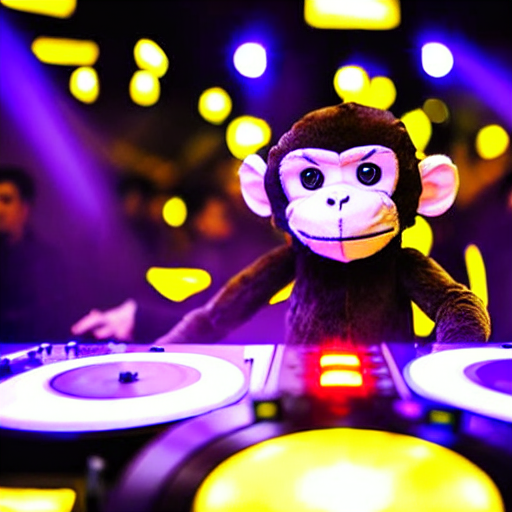</td>
  </tr>
</table>

---

### byn plushy monkey as an astronaut walking on the surface of Mars, red rocks and dust, photorealistic render

<table>
  <tr>
    <td>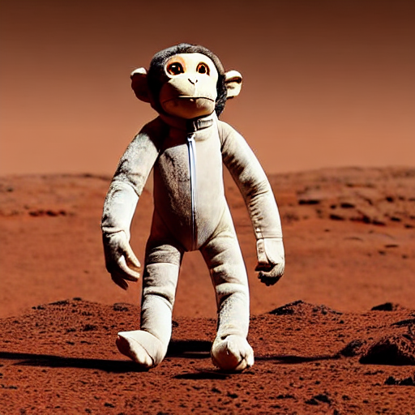</td>
    <td>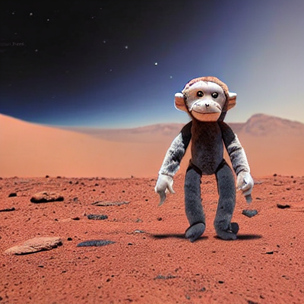</td>
  </tr>
</table>

---
